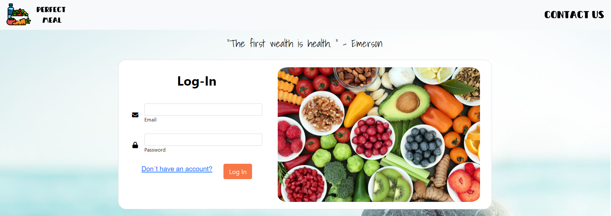
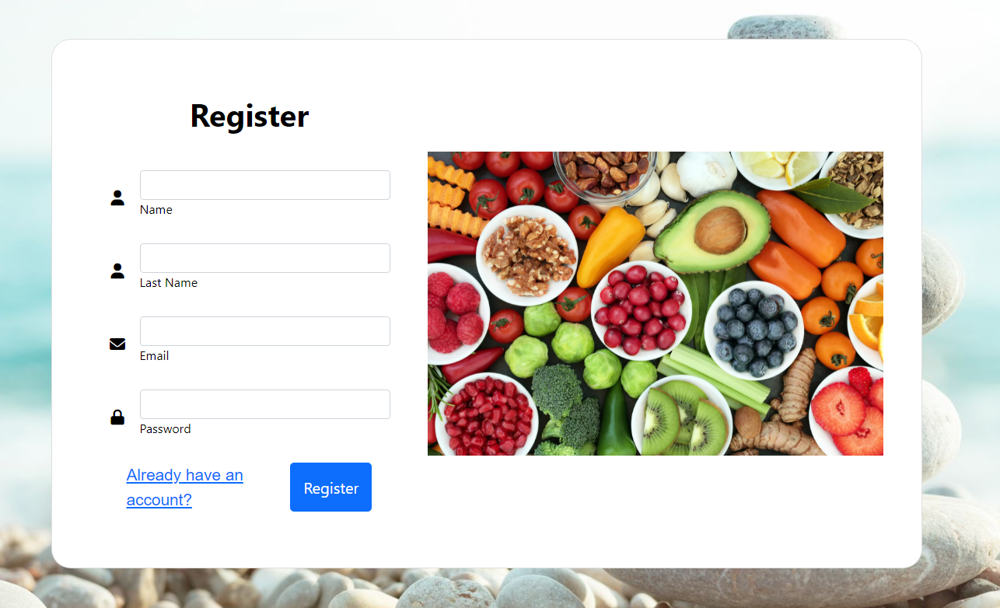
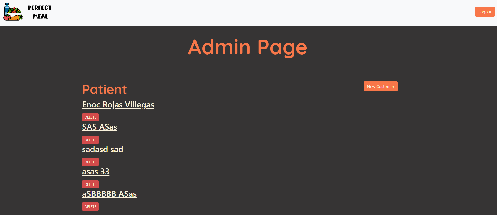
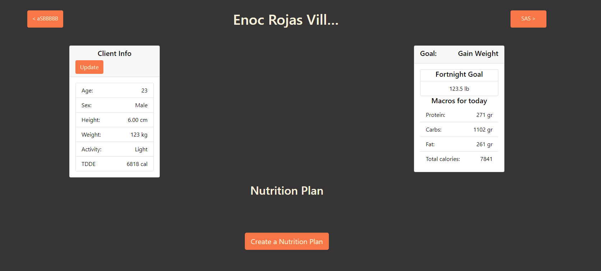
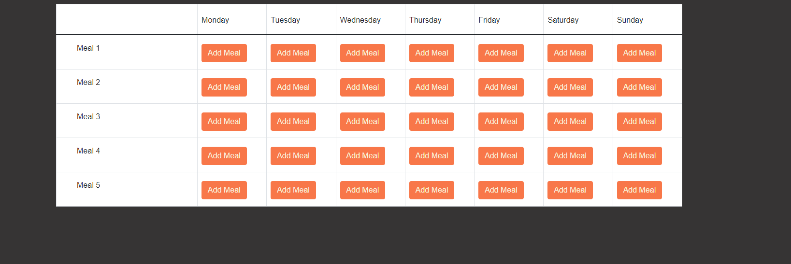

# Perfect Meal

## Description

- ### What was your motivation?  

  Our motivation begins with wanting to help Nutriologists meet their results when handling more customers. To have an app that impulses their work and feel safe using it.

- ### Why did you build this project?  

  To create an app where customers can receive their plans from their favorite nutriologist.

- ### What problem does it solve?  

  Handling large amounts of customers, easy views of each patients record, and easily adding meals, to a dynamic calendar.

- ### What did you learn?  
  We learned how to implement the BackEnd with requests made from the FrontEnd, how to handle each endpoint and manage that information. We managed MVC folder structure, use modals, OOP, server handling with Express, and dynamic HTMLS with handlebars.
   
- ### Briefly describe your Project:  
  The App starts with a login form for Nutritionists to access their patients information, this gives them access to antoher page where they can add or delete Patients, having credentials also gives them access to manage other info, like calculating MACROS for each Patient, and generate a calendar for the customer with each meal.
   
  
  Visite the website: https://thawing-depths-19417.herokuapp.com/

## Table of Contents

- [Description](#description)
- [Installation](#installation)
- [Usage](#usage)
- [ScreenShots](#screenshots)
- [License](#license)
- [Contributing](#contributing)
- [Questions](#questions)

## Installation

What are the steps required to install your project?

    This will be Deployed to Heroku to be visited, but if this respository is cloned, you should "npm i" for dependencies. 2. and to run locally use "npm start"

## Usage

Provide instructions for use:

    npm i once cloned, and npm start to initialize server.

## 

## ScreenShots

## Contributors

Abimael Monarrez, Enoc Rojas, Ernesto Ramirez, Guillermo Lazo

## Questions

Check us out Individually! 
Find us on GitHub: 
 
(https://github.com/Abimael1996)  
(https://github.com/Enrique-Rojas-Villegas)  
(https://github.com/glazovg)  
(https://github.com/ernest1589)  
